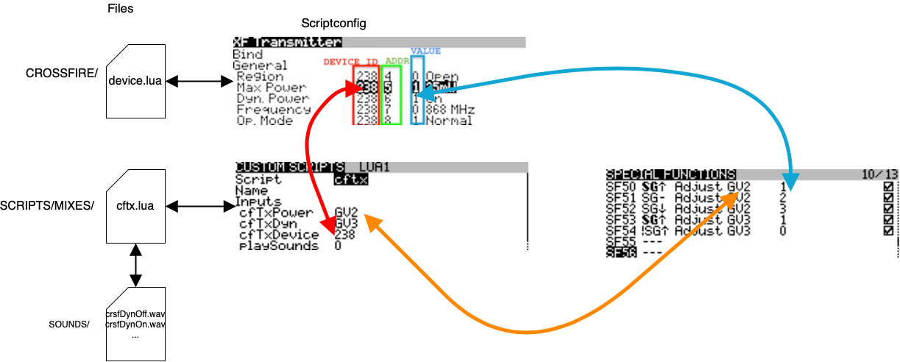
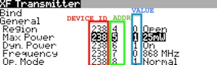
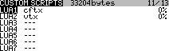
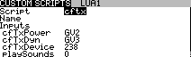
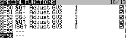

# TBS Crossfire TX Script

Foreword: I'm not an OpenTX or experienced LUA programmer. Just sharing a homebrewed script.

This LUA script lets you change the output power of your TBS Crossfire TX module based on a switch on your Radio.
You can also enable or disable dynamic power.

cftx.lua will to the actual telmentry call to the module.
A modified device.lua can show you your device ID and addresses to allow adjustments based on your need.

## Requirements
- OpenTX 2.2/2.3x compiled with LUA support (like opentx-x9d+-noheli-lua-luac-en)
- TBS Crossfire TX Module - works with Micro TX or Full TX (firmware later then v2.88)
- latest OpenTX crossfire scripts i.e. https://drive.google.com/open?id=1YioQ2nS29a4gQlYbjqz66X7JjPSfVYnw (props: KamiKatzeFPV)

## Installation
- place cftx.lua in SCRIPTS/MIXES/
- [optional] override device.lua in CROSSFIRE/

## Configuration
The script is tested and currently configured to work with Crossfire v3.x
But there are 3 major things to configure or check:
 - device address
 - dyn power address
 - tx power address

Execute the crossfire script (device.lua) to figure your addresses out:

Validate, and correct, the addresses in cftx.lua script if needed.

!Note: with wrongly configured addresses the script may not work at all - or change different values which can result in a temporary connection-loss!

Once set up, we need to create two global variables (GV) which will act as input for the script.

Edit your Model, go to SCRIPTS Page and configure the cftx.lua script.

Enter the global variable and the device id found earlier.
You can either or both enable the sounds or beep by setting each value to 1 - or disable by set it to 0 here

In this example we configure one variable to enable/disable dynamic power and another to set the max power output.
(Tip: the suggested value can be viewed int he crossfire-device.lua script as well )

Then just configure a condition or switch to alter the global variable:

In the example above, one 3 way switch will do:

 - POS1
	* enable dynamic power
	* set max output to 25mW
 - POS2
	* disable dynamic power
	* set max output to 100mW
 - POS3
	* set the max output to 500mW

## Disclaimer
Use on own risk, handle with care & without any warranty! 
This can cause your RC Link to break and/or loose models if handled inapporiatly
